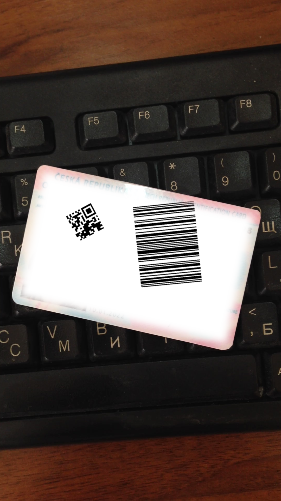
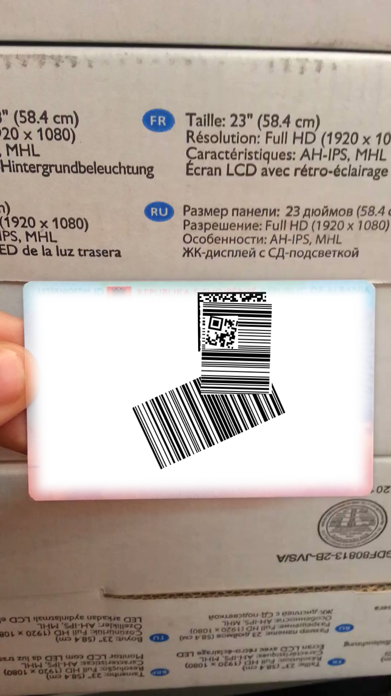

# Ссылка на датасет

[Датасет](https://disk.yandex.ru/d/RlW-0dqfkZciDQ)

# Содержимое репозитория [отчет]

## Задача

Разработать программный код для генерации синтетических, но реалистичных изображений штрихкодов с разметкой, чтобы дополнить существующие датасеты для обучения моделей распознавания.

### input / output

**input:**    параметры гренерации, датасет MIDV для основы;\
**output:**   сгенерированные изображения с разметкой;

### критерии оценки

- Реалистичность данных
- Разнообразие данных
- Улучшилось ли качетсво при использовании синтетических данных в обучении

### данные

В качестве фона для баркодов используются данные из датсета [MIDV](https://www.kaggle.com/datasets/kontheeboonmeeprakob/midv500)

### ограничения

- **Искажения**
    - проективное искажение;
    - увеличение / уменьшение относительного размера баркода;
    - поворот;
    - наложение баркодов друг на друга;
    - ~~мятые искажения~~;
    - ~~выбитые барсели~~;
    - ~~обрезанная часть баркода~~;
- **Количество бракодов и их разнообразие на снимке**
    - один баркод на изображении;
    - несколько одинаковых баркодов;
    - несколько разных баркодов;
- **Типы баркодов**
    - qrcode; 
    - azteccode; 
    - pdf417; 
    - datamatrix; 
    - code128; 
    - code39; 
    - ean13; 
    - ean14; 
    - ean8; 
    - issn; 
    - microqrcode; 
    - upca; 
    - pzn; 

## Описание метода

1. С помощью библиотеки treepoem генерируется баркод.
2. Выбирается рандомное изображение из датасета MIDV.
3. Создается "холст" размером с документ, куда наносится баркод некоторого размера (случайного, но в пределах нормы), в случайное место "холста". Баркод не должен выходить за переделы полотна.
4. Применяется случайный поворот баркода.
5. При нескольких баркодах, нанесение и поворот баркода повторяются. 
6. К холсту вместе с баркодом применяется проективное искажение в соответсвии с данными из MIDV.
7. "Холст" с некоторым сглаживанием границ крепится к изображению фона.
8. Создается разметка для всех баркодов, устанавливаются наложения баркодов друг на друга и добавляется тег: id (impossible to detect).
9. Результирующие разметка и изображение кладутся в директорию ./simulation/result_data .

## Результаты

Ипользуя за основу датасет MIDV можно создать данные содержащие баркоды и разметку к ним. Которые при этом выглядят реалистично.

### ПО (инструкция)

Инструкцию по использованию кода можно найти здесь:  [Инструкция](https://github.com/Keiko-Chan/mipt2025-Dudenko-E-I/blob/main/simulation/Readme.md)

### анализ сложных случаев

- Код работает довольно долго, не оптимизирован;
- Спорная ситуация с сильными перекритиями баркодов, некоторые из них будут совсем не видны, но разметка для них остается, пусть и с тегом id (impossible to detect);
- Тэг id (impossible to detect) добавляется при любом значимом перекрытии, даже если код в теории еще можно декодировать, пока не понятно как отличить такой случай от мешающего перекрытия;

### дальнейшие действия  

- расширение ограничений наложенных на генерацию баркода;
- оптимизация времени работы;
- повысить удобство использования для множественной генерации разнообразных данных;

### показатели / измерения

Синтетические данные пока не использовались для обучения, так что пока 

### ~~описание данных~~

    

